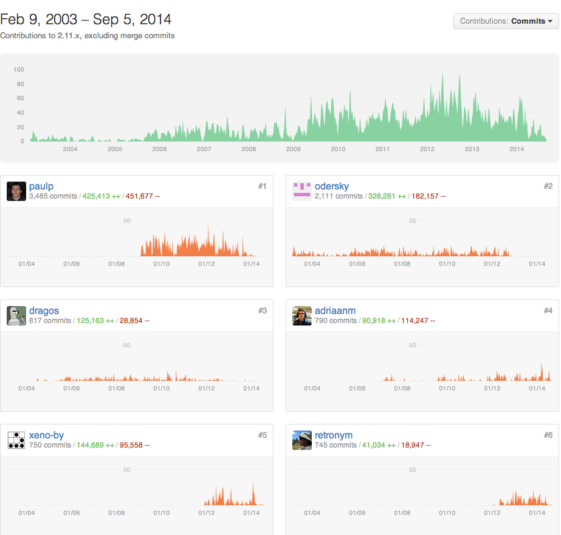

policy - a compiler
===================

Background
----------

This is a fork of the [scala](https://github.com/scala/scala) compiler. The goal is to fix some of the innumerable problems with scala while retaining a painless transition path for existing scala code.

Status
------

It's still in development, in every imaginable sense. I would prefer not to publish code in this condition, which although way ahead of scala/scala is still far short of anything I'd want to put my name on. However since typelevel has also forked the scala compiler, publishing now and giving them an opportunity to exploit my work seems the lesser evil.

So for now please resist reporting bugs if it's something most likely already obvious to me.

Changes
-------

The material changes at this point:

 - an extensive sbt-driven build system
 - (reluctantly) brought partest back from separate repository, minor improvements
 - deletion of lots of the worst and/or least necessary code
 - deletion of tons of useless and unmaintained compiler log messages
 - eliminated scala-reflect jar (I intend to eliminate the entire useless scala-reflect layer)
 - eliminated asm fork in favor of standard asm dependency[*]
 - trailing commas! I think that's the only "feature".

[*] Except a necessary one-character fix means we can't use asm 5.0.3, so there is a bundled prebuilt asm-5.0.4-SNAPSHOT built with the fix.

The commits relative to scala/scala 2.11.x can be seen like so:
```
# 48f3957fb5 is the subtree merge of partest, which introduces a lot of
# noise the commit history if not excluded.
% git log --oneline master ^origin/2.1{1,2}.x ^48f3957fb5
```

Compatibility
-------------

The whole scala test suite still passes, except for the tests I've removed. Since I deleted views, parallel collections, and other albatrosses, I deleted all their tests too. These weren't always cleanly separated so there was a bit of collateral deletion. However the fact that ~4000 tests pass should offer a little confidence that if we have diverged, we haven't diverged far.

My intention is to backstop outright deletions with extension methods in auxiliary jars such that source compatibility can be retained by adding a legacy dependency, e.g. depend on policy-legacy-views and obtain implicit classes which install the old views onto the core collections types. This isn't done yet. In the case of views specifically, it's difficult to believe anyone will ever want this as there will be views which actually work.

The major message is that it will remain possible to compile normal scala code unless that goal becomes in dire conflict with other goals.

Usage
-----

To build and run the tests:

```
% sbt test
...
3797/3797 passed (elapsed time: 00:32:47)
Test Run PASSED
% sbt about
[info] Set current project to policy (in build file:/l/policy/)
[info] scala-tool:
[info]   ~/.ivy2/local/org.improving/bootstrap-library/1.0.0-M4/jars/bootstrap-library.jar
[info]   ~/.ivy2/local/org.improving/bootstrap-compiler/1.0.0-M4/jars/bootstrap-compiler.jar
[info]   ~/.ivy2/cache/jline/jline/jars/jline-2.12.jar
[info]   /l/policy/lib/asm-5.0.4-SNAPSHOT.jar
[info] This is sbt 0.13.5
[info] The current project is {file:/l/policy/}root 1.0.0-M4
[info] The current project is built against Scala 1.0.0-M4
```

You can update the bootstrap compiler in place:

```
% sbt
[info] Set current project to policy (in build file:/l/policy/)
> publishLocalBootstrap
...
[info]  published bootstrap-compiler to ... 1.0.0-20140905-104026-3313c76c50-115620/jars/bootstrap-compiler.jar
...
> about
[info] This is sbt 0.13.5
[info] The current project is {file:/l/policy/}root 1.0.0-M4
[info] The current project is built against Scala 1.0.0-20140905-104026-3313c76c50-115620
>
```

I've written a whole lot in the feature department, but I am proceeding very slowly with incorporating improvements in order to keep a firm grip on the transition path from scalac. The test infrastructure must be significantly expanded and automated before I can integrate nontrivial changes. However, I do loathe all the comma-shuffling busywork, and there ought to be SOME value-add for someone who doesn't care how hard it is to work on scalac, so here's that one feature.
```
scala> List(1, 2, 3,)
res0: List[Int] = List(1, 2, 3)

scala> println("Yes!")
Yes!
```

A Fork!? You Should Improve Scalac!
-----------------------------------

I'm the guy in the upper left.



They would have kept paying me nicely to throw myself against the ramparts of scalac. I took a 100% pay cut and then kept working on the same open source code base. When you have 3500 commits in the scala repository and you take a 100% pay cut, then we can discuss when a fork is justified.

In the meantime, this is a fork. It isn't the kind of fork that hopes eventually to be folded back into the original. The leadership of scala has shown itself unfit stewards of the core technologies and the total price paid by scala programmers (actual and potential) is too high. I failed for half a decade to change that from the inside. Now I'll try from the outside.

Who Are You?
------------

I'm Paul Phillips and (despite everything you've heard) I'm a splendid chap.
